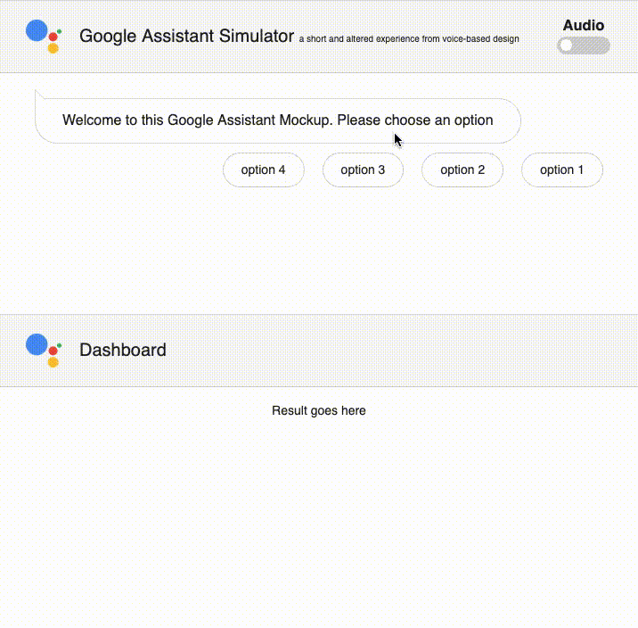

# ga-mockup
A Google Assistant mockup for clean and focused interactive demo purposes of a voice-based app. The bottom half of the page can be used for showing any output of the conversation. This is a very simple HTML + JavaScript mockup.

See this mockup live [here](https://www.davidverweij.com/ga-mockup).

I used this mockup to demonstrate a voice app to configure data visualisation objects, see [dwidgets.web.app](https://dwidgets.web.app/) or [davidverweij.com/googlesimulator](https://www.davidverweij.com/googlesimulator/).
